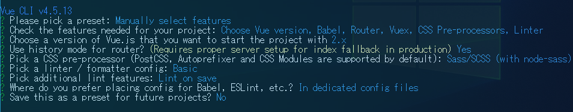

## Vue.jsとFirestoreでWebアプリを構築してみた[手順書]

[参考にしたサイト](https://savvyapps.com/blog/definitive-guide-building-web-app-vuejs-firebase)

[github](https://github.com/savvyapps/SAVuegram)


## 1. 初期設定

### 1-1. Vue CLIのインストールとプロジェクトの作成

```
npm i -g @vue/cli
vue create vue-app
```



```
cd vue-app
npm run serve
```


### 1-2. vueファイルの作成

以下を追加。views/ Login.vue, Dashboard.vue, Setting.vue

### 1-3. routerの修正

Dashboardをルートに、login, settingsを追加

### 1-4. 不要ファイルの削除

Home.vue, About.vue, assets/logo.png, components/HelloWorld.vue

### 1-5. App.vueの修正

router-viewのみ


## 2. Firebaseのセットアップ

### 2-1. Firebaseプロジェクトの作成

asia-northeast1 (東京) を選択

### 2-2. `npm i firebase`

### 2-3. firebase.jsファイルの作成と設定

- firebase init　…　プロジェクト設定/マイアプリ　にある
- utils (db, auth)
- collection refs
- export utils / refs

### 2-4. main.jsの修正


```js
firebase.auth().onAuthStateChanged(user=>{
    if(user) {
        // login now
    }
})
```


## 3. vue-routerの認証設定

### 3-1.  `import {auth} from '../firebase'`

### 3-2.  metaオブジェクトの追加

メタデータ：でーたのおまけみたいなもの

`meta:{requiresAuth: true}`で認証が必要なルートを指定するよう実装

### 3-3.  ナビゲーションガードの設定

`router.beforeEach`ですべてのルートを通すナビゲーションガード（ページ遷移時に起動する処理）を実装

loginしていない場合、/loginに飛ばす

### 3-4.  動作確認


## 4. Login Signup Viewの作成

### 4-1. scssファイルのインポート

main.jsにインポートする

### 4-2. Login.vueにマークアップ

マークアップ→バインディングするデータを定義→v.model.trim, @submit.preventを定義

v.model.trim : 空白をなくす

@submit.prevent : formの送信による再読み込み処理をなくす

### 4-3. login()の作成とvuexの作成

- login()メソッドの作成（dispatchでactionにアクセス）

- action : login() → action : fetchUserProfile →mutation : setUserProfile → state : userProfile の流れでデータを格納

### 4-4. signupロジックのマークアップ

- loginフォームと並列にマークアップ→data()にデータを用意
- action : signup() → action : fetchUserProfile →mutation : setUserProfile → state : userProfile の流れでデータを格納

### 4-5. ログインとサインアップの切り替え機能の追加

v-ifで切り替え機能を追加

### 4-6. パスワードを忘れた場合のロジックの追加

- markup→データの追加→togglePasswordReset()メソッドの追加→PasswordReset.vueの作成→Login.vueにコンポーネントを登録

### 4-7. firestoreセキュリティの実装

```js
rules_version = '2';
service cloud.firestore {
  match /databases/{database}/documents {
    match /{document=**} {
      allow read, write: if 
      		request.time < timestamp.date(2021, 6, 17);
      allow write: if
      		request.auth.uid != null 
    }
  }
}
```


## 5. ナビゲーションの作成

### 5-1. SiteNav.vueファイルのマークアップ

マークアップ（title, /, /setting logoutのリンク作成）

### 5-2. logout()の作成

SiteNav.vueにlogout()を実装→store/index.jsを更新

### 5-3. App.vueの更新

 App.vueにSiteNav.vueを集約させる

このままだと、ログインして更新するとナビゲーションが消えてしまう


## 6. ページリロードにおけるユーザ状態の処理

### 6-1. main.jsの更新（onAuthStateChanged）

### 6-2. store/index.jsの更新

onAuthStateChangedはリロード時に起動する

store.dispatch('fetchUserProfile', user)で常に'/'に飛ぶので修正する


## 7. ダッシュボードの作成

### 7-1. dashboard.vueへのマークアップ

### 7-2. 投稿を作成する機能の追加

createPost()メソッドでvuex : actionのcreatePostを呼び出しpostCollectionsに登録

### 7-3. すべての投稿を取得しDOMにレンダリングする

- storeのexportのやりかたを変更 (fb.postsCollectionを切り出すため)
  - 外出ししたfb.postsCollectionはpostsが更新されるたびに起動する
- momentをインストールしてv-forでレンダリング

### 7-4. コメントの実装

- クリックイベントの追加
- CommentModal.vueの作成
  - closeボタンは$emitで、投稿(post)と紐づけるためにpostをpropsで渡す。
  - modalはv-ifで表示非表示を制御
- import

### 7-5. 「いいね」の実装

- クリックイベントの追加、メソッドの追加、actionの追加

### 7-6. 「コメント」の表示　●

- クリックイベントの追加、マークアップ、メソッドの追加


## 8. 設定

### 8-1. Settings.vueでマークアップを設定

### 8-2. 基本データの設定

### 8-3. updateProfile()の実装

### 8-4. store /index.jsファイルにアクションメソッドupdateProfileを作成


## その他ポイント

store/index.js

```js
const store = new Vuex.Store({
  state: {
    userProfile: {},  	// ログインしたユーザ情報が格納される
    posts:[]			// すべての投稿が格納される（ログインしたユーザ以外も含む）
  },
```

