# vue-realworld-example-appを読んでみた

## 📌背景

この[リポジトリ](https://github.com/gothinkster/vue-realworld-example-app)は、実世界の例（CRUD、認証、高度なパターンなど）を含むVue.jsプロジェクトである。Webアプリケーションの基本的な機能が一通りまとまっている。本記事は、一般的なVue.jsプロジェクトはどのような構成になっているか、どのような技術が使われているかを知るために、この[リポジトリ](https://github.com/gothinkster/vue-realworld-example-app)をソースリーディングしまとめたものである。


## 📌全体構成の確認

### 📖フォルダ構成

`/src`構成は以下の通り。

- `/views` 

  router/index.jsでルーティング指定されている各ページを格納している。

- `/router`

  **Vue Router**によるルーティングの設定を行っている。

- `/components`

  アプリ内で共通で使用する機能を実装する。

- `/store`

  **Vuex**による状態管理を行っている。/views, /components内の.vueファイルから呼ばれる。

- `/common` 

  共通機能がまとまっている。基本的に`/store`から呼ばれる。

- `App.vue`、 `main.js`

  アプリのエントリーポイントとなり、アプリ全体の設定などはここで行う。

  

### 📖コンポーネント構成

コンポーネント構成は下記の通りである。**「緑＝/views、黄色＝/components」**である。




ある程度リポジトリの全体構成が見えてきた。続いて、1つずつソースコードを見ていく。


## 📌 ソースコード詳細

### 📖 main.js、App.vue

#### 🔖 `main.js`

```js
import DateFilter from "./common/date.filter";
import ErrorFilter from "./common/error.filter";

Vue.filter("date", DateFilter);
Vue.filter("error", ErrorFilter);
```

アプリ全体で使用する、日付変換（`date`）や エラー変換(`error`)のフィルターはここで定義する。
これらは/commonで定義されている。


```js
import ApiService from "./common/api.service";

ApiService.init();
```

初期化処理を記載している。
`ApiService.init()`では、`axios`プラグインを適用し、デフォルトURLを設定している。


```js
import { CHECK_AUTH } from "./store/actions.type";

router.beforeEach((to, from, next) =>
  Promise.all([store.dispatch(CHECK_AUTH)]).then(next)
);
```

`router.beforeEach()`はページロードごとに呼ばれる関数。`Promise.all()`は、配列を引数にとり、すべてのPromiseを実行する。ここでトークンを用いて認証処理をする。


#### 🔖`App.vue`

```vue
<template>
  <div id="app">
    <RwvHeader />
    <router-view />
    <RwvFooter />
  </div>
</template>
```

ヘッダ、フッタはここで指定する。


### 📖 / router 

#### 🔖`index.js`

```js
routes: [
    {
        path: "/",
        component: () => import("@/views/Home"),
        children: [
            {
                path: "",
                name: "home",
                component: () => import("@/views/HomeGlobal")
            },
            ...
   		],
        ...
	},
    ...
]
```

`children`を使用することで、routerを2段階構成にしている。
上記の例ではHomeの中で使用するHomeGlobalのルートを`children`で指定している。
また`name`をつけることで、`<router-link :to={ name: 'home' }>`と指定できるようになる。


### 📖 /views

####  🔖 / views / Home.vue 周辺

- **`Home.vue`**

`<router-link>`で HomeGlobal、HomeMyFeed、HomeTag にリンクをはり、
`<router-view>`で表示する仕組みになっている。


```vue
<script>
import { mapGetters } from "vuex";
import RwvTag from "@/components/VTag";
import { FETCH_TAGS } from "@/store/actions.type";
export default {
  name: "home",
  components: {
    RwvTag
  },
  mounted() {
    this.$store.dispatch(FETCH_TAGS);
  },
  computed: {
    ...mapGetters(["isAuthenticated", "tags"]),
    tag() {
      return this.$route.params.tag;
    }
  }
};
</script>
```

`mounted()`では、またこちらもVuexのactionを使用し、`FETCH_TAGS`を実行し、APIから取得した`tags`を`mapGetter()`で使用できるようにしている。`mapGetter()`は引数で指定したstateの値を取得する関数で、computedで使用する。


- **`HomeGlobal.vue`, `HomeMyFeed.vue`, `HomeTag.vue`**

```vue
<template>
  <div class="home-global"><RwvArticleList type="all" /></div>
  <!--
	<div class="home-my-feed"><RwvArticleList type="feed" /></div>
  	<div class="home-tag"><RwvArticleList :tag="tag"></RwvArticleList></div>
  -->
</template>
```

templateの中身を見るとどれも似た構成。`@/components/ArticleList`を呼び、属性 ( type )を変えているだけ。


####  🔖/ views / Login.vue , Register.vue, Settings.vue

- **`Login.vue`**

```html
<form @submit.prevent="onSubmit(email, password)">
...
</form>
```

v-modelでバインディングして、ボタン押下すると値が送信される一般的なフォームの実装となっている。`@submit.prevent`は`event.preventDefault()`を呼び出す処理。これをつけることでフォーム送信後もページのリロードを行わないようにする。`.prevent`はイベント修飾子と呼ばれる。


```js
import { mapState } from "vuex";
import { LOGIN } from "@/store/actions.type";

export default {
  ...
  data() {
    return {
      email: null,
      password: null
    };
  },
  methods: {
    onSubmit(email, password) {
      this.$store
        .dispatch(LOGIN, { email, password })
        .then(() => this.$router.push({ name: "home" }));
    }
  },
  ...
}; 
```

ログインが成功したら、`.then(() => { this.$router.push({ name: "home" })});`を行い、ホームに飛ばす処理が入っているのがみそ。


```js
import { mapState } from "vuex";

export default {
  ...
  computed: {
    // auth.errors を errors に代入する処理。
    // ↓ 加工後の名称: state => 加工処理(state.加工対象のステート名)
    ...mapState({
      errors: state => state.auth.errors
    })
  }
};
```

上記の書き方は、stateを加工した結果をバインドする方法。


- **`Register.vue`**

`Login.vue`とほぼ同じ構成。違いは、フォームに`username`の欄ができて、Vuex.actionの呼び出しが、`LOGIN`から`REGISTER`になったくらい。


- **`Setting.vue`**

`Login.vue`や`Register.vue`とほぼ同じ構成。


####  🔖/ views / Profile.vue 周辺

- **`Profile.vue`**

`<router-link>`で ProfileArticles、ProfileFavorited にリンクをはり、
`<router-view>`で表示する仕組みになっている。


```vue
<div v-if="isCurrentUser()">
  <router-link
    class="btn btn-sm btn-outline-secondary action-btn"
    :to="{ name: 'settings' }"
  >
    ...
  </router-link>
</div>
<div v-else>
  <button
    class="btn btn-sm btn-secondary action-btn"
    v-if="profile.following"
    @click.prevent="unfollow()"
  >
    ...
  </button>
  <button
    class="btn btn-sm btn-outline-secondary action-btn"
    v-if="!profile.following"
    @click.prevent="follow()"
  >
    ...
  </button>
</div>
```

`<div v-if="isCurrentUser()">`でログイン中のユーザかどうかで表示画面が変わる。
`v-if="profile.following"`部分も同様で、フォローしているかどうかで表示画面が変わる。


```js
import {
  FETCH_PROFILE,
  FETCH_PROFILE_FOLLOW,
  FETCH_PROFILE_UNFOLLOW
} from "@/store/actions.type";

export default {
  ...
  mounted() {
    this.$store.dispatch(FETCH_PROFILE, this.$route.params);
  },
  ...
  watch: {
    $route(to) {
      this.$store.dispatch(FETCH_PROFILE, to.params);
    }
  }
};      

```

初期化時に`mounted()`で、ページのユーザ名をルートのパラメータから取得する。

Vue.jsではパラメータが `#/@hoge` から `#/@huga` へ遷移するときに**同じコンポーネントインスタンスが再利用される**ので`watch: $route(to){...}`を使用して、パラメータの検地をおこなっている。[参考](https://router.vuejs.org/ja/guide/essentials/dynamic-matching.html#%E3%83%8F%E3%82%9A%E3%83%A9%E3%83%A1%E3%83%BC%E3%82%BF%E3%83%BC%E5%A4%89%E6%9B%B4%E3%81%AE%E6%A4%9C%E7%9F%A5)


- **`ProfileArticles.vue`、`ProfileFavorited.vue`**

```vue
<template>
  <div class="profile-page">
    <RwvArticleList :author="author" :items-per-page="5"></RwvArticleList>
    <!--
    <RwvArticleList :favorited="favorited" :items-per-page="5">
    </RwvArticleList>
    -->
  </div>
</template>
```

templateの中身を見るとどれも似た構成。`@/components/ArticleList`を呼び、属性 ( author, favorited )を変えているだけ。


####  🔖/ views / Article.vue 

```js
import store from "@/store";
import { FETCH_ARTICLE, FETCH_COMMENTS } from "@/store/actions.type";

export default {
  //...
  beforeRouteEnter(to, from, next) {
    Promise.all([
      store.dispatch(FETCH_ARTICLE, to.params.slug),
      store.dispatch(FETCH_COMMENTS, to.params.slug)
    ]).then(() => {
      next();
    });
  }
  //...
}
```

`beforeRouteEnter()`を用いて、`FETCH_ARTICLE`、`FETCH_COMMENTS`を呼び、articleとcommentの最新のものを取得しstateを更新する。[参考](https://router.vuejs.org/ja/guide/advanced/navigation-guards.html#%E3%83%AB%E3%83%BC%E3%83%88%E5%8D%98%E4%BD%8D%E3%82%AB%E3%82%99%E3%83%BC%E3%83%88%E3%82%99)


```html
<div v-html="parseMarkdown(article.body)"></div>
```

```js
import marked from "marked";
// ...

export default {
  // ...
  methods: {
    parseMarkdown(content) {
      return marked(content);
    }
  }
}
```

`marked()`はマークダウン解析ツール、htmlを返すため、`v-html`ディレクティブを使用している。


####  🔖/ views / ArticleEdit.vue 

```js
  // /editor/:slug => /editor の場合、エディタを空にして表示する。
  async beforeRouteUpdate(to, from, next) {
    await store.dispatch(ARTICLE_RESET_STATE);
    return next();
  },
  // /editorの場合は下記のifがfalseになり、実行される。
  // /editor/:slug の場合は下記のifがtrueになり、実行される。 
  async beforeRouteEnter(to, from, next) {
    await store.dispatch(ARTICLE_RESET_STATE);
    if (to.params.slug !== undefined) {
      await store.dispatch(
        FETCH_ARTICLE,
        to.params.slug,
        to.params.previousArticle
      );
    }
    return next();
  },
  // /editor/:slug から去るときエディタを空にする。
  async beforeRouteLeave(to, from, next) {
    await store.dispatch(ARTICLE_RESET_STATE);
    next();
  },
```

ナビゲーションガードで制御する。記事エディタを空に更新するが、/editor/slugのように、ArticleEditにアクセスする場合は、元記事が記載されたままで表示する。

※ ちなみに上記のナビゲーションガードは、パラメータが変わったタイミングでは実行されないので、 `/editor` から`/editor/:slug `に遷移した場合、元記事が記載されない。


```vue
<template>
   ... 
  <input
       type="text"
       class="form-control"
       placeholder="Enter tags"
       v-model="tagInput"
       @keypress.enter.prevent="addTag(tagInput)"
    />
  <div class="tag-list">
    <span
      class="tag-default tag-pill"
      v-for="(tag, index) of article.tagList"
      :key="tag + index"
    >
 	  <i class="ion-close-round" @click="removeTag(tag)"> </i>
      {{ tag }}
	</span>
  </div>
  ...
</template>
```

タグの登録処理は、`@keypress.enter.prevent="addTag(tagInput)"`でエンター押下時にタグ登録処理を行う実装となっている。


### 📖 /components

####  🔖/ components / TheHeader.vue

```html
<ul v-if="!isAuthenticated" class="nav navbar-nav pull-xs-right">
  ....    
</ul>
<ul v-else class="nav navbar-nav pull-xs-right">
  ....
</ul>
```

認証状態によって表示する画面を`v-if`で切り替えている。


```html
<router-link
  class="nav-link"
  active-class="active"
  exact
  :to="{
    name: 'profile',
    params: { username: currentUser.username }
   }"
>
  {{ currentUser.username }}
</router-link>
```

`<router-link>`では`:to=params:{...}`でパラメータを指定することができる。


#### 🔖 / components / VTag.vue

```html
<router-link :to="homeRoute" :class="className" v-text="name"></router-link>
```

`v-text="name"`は`{{ name }}`と同じ

```js
export default { 
  props: {
    name: {
      type: String,
      required: true
    },
    className: {
      type: String,
      default: "tag-pill tag-default"
    }
  }
  // ...
}
```

`props`にて、型の指定（type）、必須項目指定（required）、デフォルト値（default）を指定できる。以降で説明するコンポーネントの`props`においても、型の指定などを必ず行っていた。


#### 🔖 / components / ArticleMeta.vue 周辺

- **`ArticleMeta.vue`**

記事作成者の情報などで構成されるコンポーネント。

```html
<span class="date">{{ article.createdAt | date }}</span>
```

main.jsで定義したフィルターが使用されていることを確認。


```html
<rwv-article-actions
  v-if="actions"
  :article="article"
  :canModify="isCurrentUser()"
></rwv-article-actions>
```

フォロー、いいねボタンはArticleActionsコンポーネントで制御している。


- **`ArtcleAction.vue`**

親コンポーネント：ArticleMeta

フォローやいいねボタンを構成するコンポーネント


```html
<span v-if="canModify">
    <!-- Edit Article, DeleteArticleボタンが表示 -->
</span>
<span v-else>
    <!-- Follow, Favoriteボタンが表示 -->
</span>
```

著者か否かで表示画面を変えている。


また、classを変えるなどの見た目の変更はcomputed, ボタン押下時の処理はmethodsで行う。


#### 🔖 / components / CommentEditor.vue 周辺

- **`CommentEditor.vue

記事に対するコメントフォームを構成するコンポーネント

```html
<RwvListErrors :errors="errors" />
<form class="card comment-form" @submit.prevent="onSubmit(slug, comment)">
```

```js
methods: {
  onSubmit(slug, comment) {
    this.$store
      .dispatch(COMMENT_CREATE, { slug, comment })
      .then(() => {
         this.comment = null;
         this.errors = {};
      })
      .catch(({ response }) => {
        this.errors = response.data.errors;
      });
  }
}
```

フォームのPostボタンを押下すると、`COMMENT_CREATE`が実行される。この処理が失敗すると、`RwvListErrors`部分でエラーメッセージが表示される。


- **`ListError.vue

errorsオブジェクトを受け取った時に、エラーメッセージを画面に表示させるコンポーネント。


#### 🔖 / components / Comment.vue

親コンポーネント：Article

コメント表示のコンポーネント。

```html
<span v-if="isCurrentUser" class="mod-options">
  <i class="ion-trash-a" @click="destroy(slug, comment.id)"></i>
</span>
```

```js
computed: {
  isCurrentUser() {
    if (this.currentUser.username && this.comment.author.username) {
      return this.comment.author.username === this.currentUser.username;
    }
    return false;
  },
  // ...
}
```

コメントを削除する部分。`isCurretntUser`が現在のユーザと著者が同じ場合は表示する。


#### 🔖 / components / ListErrors.vue

errorsオブジェクトを受け取った時に、エラーメッセージを画面に表示させるコンポーネント。`CommentEditor.vue`でも使用している。


#### 🔖 / components / ArticleList.vue

記事プレビュー一覧を表示するコンポーネント。

大まかな処理は、`listConfig`に記事情報を持たせて、`currentpage`, `type`, `author`, `tag`, `favorited`（`watch`で監視）に変更があったら、`fetchArticle()`で新しい記事を取得する流れである。


#### 🔖 / components / VArticlePreview.vue 周辺

- **`VArticlePreview.vue`**

記事プレビューを表示するコンポーネント。

ArticleMeta.vueとTagList.vueコンポーネントを使用している。


- **`TagList.vue`**

タグ一覧を表示するコンポーネント。


#### 🔖 / components / VPagination.vue

ページ割りの表示をするコンポーネント。

```html
<li
  v-for="page in pages"
  :data-test="`page-link-${page}`"
  :key="page"
  :class="paginationClass(page)"
  @click.prevent="changePage(page)"
>
  <a class="page-link" href v-text="page" />
</li>
```

`:class="paginationClass(page)"`で現在のページと一致していたらactive-classをつけ、表示を変える。


ページ割りのボタンが押下されたら、`@click.prevent="changePage(page)"`を実行する。

```js
changePage(goToPage) {
  if (goToPage === this.currentPage) return;
  this.$emit("update:currentPage", goToPage);
},
```

親コンポーネント（`ArticleList.vue`）では、以下のように呼んでいる。

```html
 <VPagination :pages="pages" :currentPage.sync="currentPage" />
```

`.sync`修飾子をつけることで、子コンポーネントから`this.$emit('update:currentPage', goToPage)` で親に通知することができる。（親は `update:prop名`のイベントを監視)
[参照1【Vue】知っておきたい .sync修飾子のすゝめ](https://jp.vuejs.org/v2/guide/components-custom-events.html#sync-%E4%BF%AE%E9%A3%BE%E5%AD%90)、[参考2_公式](https://jp.vuejs.org/v2/guide/components-custom-events.html#sync-修飾子)


### 📖 /store

####  🔖 / store / index.js

```js
import Vue from "vue";
import Vuex from "vuex";

import home from "./home.module";
import auth from "./auth.module";
import article from "./article.module";
import profile from "./profile.module";

Vue.use(Vuex);

export default new Vuex.Store({
  modules: {
    home,
    auth,
    article,
    profile
  }
});
```

ストアオブジェクトを複数のファイルで管理するために、`modules`を使って分割を行う。


