# vue-realworld-example-appを読んでみた

コードリーディングを行ったリポジトリはこちらです。

[gothinkster/vue-realworld-example-app](https://github.com/gothinkster/vue-realworld-example-app)
[codesandbox](https://codesandbox.io/s/github/gothinkster/vue-realworld-example-app/tree/master)

#### 更新履歴

2021/6/15 誤字脱字の修正、わかりにくい表現の見直し。全体的な内容の追加。
2021/6/13 初版


## 📌はじめに

### 📖 記事の背景

[**vue-realworld-example-app**](https://github.com/gothinkster/vue-realworld-example-app) は、実際のアプリで使用する機能（CRUD、認証、ルーティングなど）を盛り込んだVue.jsプロジェクトである。Webアプリケーションの基本的な機能が一通りまとまっている。

本記事は、一般的なVue.jsプロジェクトはどのような構成になっているか、どのような技術が使われているかを知るために、[**vue-realworld-example-app**](https://github.com/gothinkster/vue-realworld-example-app) をコードリーディングし、まとめたものである。


### 📖 ( 参考 前提知識 )

コードリーディングを行うにあたる前提知識として、以下が必要と感じた。

- Vue.js v2 （Router、Vuex）の基礎知識
- Vue CLI の基礎知識

また、知っているとよいと感じた知識は以下。（調べながらで読めると思います）

- REST API の基礎知識
- JWTの基礎知識 
- ローカルストレージの基礎知識


## 📌全体構成の確認

### 📖フォルダ構成

`/src`構成と役割は以下の通り。

- `App.vue`、 `main.js`
  アプリのエントリーポイント。アプリ全体の設定などはここで行う。
- `/views` 
表示する画面のコンポーネントを管理する。ルーティングと対応している。
- `/router`
Vue Routerによるルーティングの設定を行っている。
- `/components`
アプリ内で使用するコンポーネントを管理する。
- `/store`
状態管理を行うVuexのフォルダ。/views, /components内のから呼ばれる。
- `/common` 
  API、JWT、フィルタ、設定などのアプリ全体で使用する共通機能。


### 📖データの流れ（参考）

フォルダのアクセスする流れを整理した。わかりにくいかもしれないので参考までに。


### 📖コンポーネント構成

コンポーネント構成は下記の通り。**「緑＝/views、黄色＝/components」**である。`/ruter`でルーティングされているコンポーネントは`/views`に、それ以外は`/components`で管理している。




### 📖 /store, /commonの構成

`/store`, `/common`の関係性は下記のとおり。

`/store`は、4つのモジュールを`export` している。それぞれのモジュールは、`state`, `getters`, `actions`, `mutations`を持ち、状態管理を行う。状態管理を行う中で、インターフェースのような役割を果たす`type`から関数名を参照したり、共通処理を`/common`を参照し、実行している。

`/common`は、`/store`で使用する共通処理ファイル（.service.js）とその設定ファイル（config.js）、アプリ全体で使用するフィルターファイル（.filter.js）を持つ。


## 📌 ソースコード詳細

各ソースコードの気になったところを抜粋して解説する。
 https://github.com/gothinkster/vue-realworld-example-app


### 📖 main.js、App.vue

#### 🔖 main.js

**フィルターの定義**

```js
import DateFilter from "./common/date.filter";
import ErrorFilter from "./common/error.filter";

Vue.filter("date", DateFilter);
Vue.filter("error", ErrorFilter);
```

アプリ全体で使用する日付変換（`DateFilter`）や エラー変換(`ErrorFilter`)のフィルターはここで設定する。フィルターそのものの定義は`/common`でしている。


**API処理の初期化**

```js
import ApiService from "./common/api.service";

ApiService.init();
```

サーバとのHTTP通信のための初期化を行う。
`ApiService.init()`では、`vue-axios`プラグインを適用し、デフォルトURLの設定をしている。


**ページロードごとの認証処理**


```js
import { CHECK_AUTH } from "./store/actions.type";

router.beforeEach((to, from, next) =>
  Promise.all([store.dispatch(CHECK_AUTH)]).then(next)
);
```

`router.beforeEach()`はページロードごとに呼ばれる関数。`Promise.all()`は、配列を引数にとり、すべてのPromiseを実行する。
ページロードごとにトークンの認証処理をしている。

[参考 Vue公式 ナビゲーションガード](https://router.vuejs.org/ja/guide/advanced/navigation-guards.html#%E3%82%AF%E3%82%99%E3%83%AD%E3%83%BC%E3%83%8F%E3%82%99%E3%83%AB%E3%83%92%E3%82%99%E3%83%95%E3%82%A9%E3%83%BC%E3%82%AB%E3%82%99%E3%83%BC%E3%83%88%E3%82%99)

[参考 MDN Promise.all()](https://developer.mozilla.org/ja/docs/Web/JavaScript/Reference/Global_Objects/Promise/all)


#### 🔖 App.vue

**ヘッダ、フッタコンポーネントの使用**

```vue
<template>
  <div id="app">
    <RwvHeader />
    <router-view />
    <RwvFooter />
  </div>
</template>
```

ヘッダ、フッタはアプリ全体で表示するため、ここで使用する。


### 📖 / router 

#### 🔖 index.js

**childrenによるネストルーティング**

```js
routes: [
    {
        path: "/",
        component: () => import("@/views/Home"),
        children: [
            {
                path: "",
                name: "home",
                component: () => import("@/views/HomeGlobal")
            },
            ...
   		],
        ...
	},
    ...
]
```

`children`を使用することで、ネストされたルートとなる。
また`name`をつけることで、`<router-link :to={ name: 'home' }>`と指定できる。

https://router.vuejs.org/ja/guide/essentials/nested-routes.html

https://router.vuejs.org/ja/api/#to


### 📖 /views

####  🔖 / views / Home.vue 周辺

- **`Home.vue`**

**ルーティング概要**

`<router-link>`で `HomeGlobal`、`HomeMyFeed`、`HomeTag` に飛ばすリンクを設定し、
`<router-view>`で表示する仕組み。


**データ（tag）の流れ**

```vue
<script>
import { mapGetters } from "vuex";
import { FETCH_TAGS } from "@/store/actions.type";
    
export default {
  // ...
  mounted() {
    this.$store.dispatch(FETCH_TAGS);
  },
  computed: {
    ...mapGetters(["isAuthenticated", "tags"]),
    tag() {
      return this.$route.params.tag;
    }
  }
};
</script>
```

`mounted()`はVuexの`action`を使用して`FETCH_TAGS`を実行し、サーバから`tags`を取得する。取得した`tags`は、Vuexの`state`で管理されるので、`mapGetter()`で取得し、コンポーネント内で使用している。

`mapGetters()`は引数で指定した`state`の値を取得する関数。`import {mapGetters} from "vue"`を使用してインポートし、`computed`で使用する。


- **`HomeGlobal.vue`, `HomeMyFeed.vue`, `HomeTag.vue`**

**template構成**

```vue
<template>
  <div class="home-global"><RwvArticleList type="all" /></div>
  <!--
	<div class="home-my-feed"><RwvArticleList type="feed" /></div>
  	<div class="home-tag"><RwvArticleList :tag="tag"></RwvArticleList></div>
  -->
</template>
```

上記3つの`<template>`はどれも似た構成。`@/components/ArticleList.vue`を属性 ( type )を変えて使用している。


####  🔖/ views / Login.vue , Register.vue, Settings.vue

- **`Login.vue`**

**フォームとsubmit ボタン**

```html
<form @submit.prevent="onSubmit(email, password)">
...
</form>
```

`v-model`でバインディングして、ボタン押下すると値が送信されるごくごく一般的なフォームの実装となっている。`@submit.prevent`は`event.preventDefault()`を呼び出す処理。これにより、フォーム送信後もページのリロードは行われない。`.prevent`は**イベント修飾子**と呼ばれる。

https://jp.vuejs.org/v2/guide/events.html#%E3%82%A4%E3%83%99%E3%83%B3%E3%83%88%E4%BF%AE%E9%A3%BE%E5%AD%90


**ログイン成功時、ホーム画面へ**

```js
import { mapState } from "vuex";
import { LOGIN } from "@/store/actions.type";

export default {
  ...
  data() {
    return {
      email: null,
      password: null
    };
  },
  methods: {
    onSubmit(email, password) {
      this.$store
        .dispatch(LOGIN, { email, password })
        .then(() => this.$router.push({ name: "home" }));
    }
  },
  ...
}; 
```

ログインに成功したら、`.then(() => { this.$router.push({ name: "home" })});`を行い、ホームに飛ばす処理となっている。


**state の加工**

```js
import { mapState } from "vuex";

export default {
  ...
  computed: {
    // auth.errors を errors に代入する処理。
    // ↓ 加工後の名称: state => 加工処理(state.加工対象のステート名)
    ...mapState({
      errors: state => state.auth.errors
    })
  }
};
```

上記は`auth.errors` を `errors` に代入する処理。

https://qiita.com/suin/items/7331905a45a8ff80d4dd#seven-%E3%82%B9%E3%83%86%E3%83%BC%E3%83%88%E5%8A%A0%E5%B7%A5%E7%B5%90%E6%9E%9C%E3%81%AE%E3%83%90%E3%82%A4%E3%83%B3%E3%83%89


- **`Register.vue`**

`Login.vue`とほぼ同じ構成。違いは、フォームに`username`の欄ができて、Vuexの`action`が、`LOGIN`から`REGISTER`になったくらい。


- **`Setting.vue`**

`Login.vue`や`Register.vue`とほぼ同じ構成。


####  🔖/ views / Profile.vue 周辺

- **`Profile.vue`**

**ルーティング概要**

`<router-link>`で `ProfileArticles`、`ProfileFavorited` に飛ばすリンクを設定し、`<router-view>`で表示する仕組み。


**認証状態に依存する画面表示**

```vue
<div v-if="isCurrentUser()">
  <router-link
    class="btn btn-sm btn-outline-secondary action-btn"
    :to="{ name: 'settings' }"
  >
    ...
  </router-link>
</div>
<div v-else>
  <button
    class="btn btn-sm btn-secondary action-btn"
    v-if="profile.following"
    @click.prevent="unfollow()"
  >
    ...
  </button>
  <button
    class="btn btn-sm btn-outline-secondary action-btn"
    v-if="!profile.following"
    @click.prevent="follow()"
  >
    ...
  </button>
</div>
```

`<div v-if="isCurrentUser()">`を使用することで、ログイン中のユーザかどうかで表示画面が変わる実装となっている。`v-if="profile.following"`部分も同様で、フォローしているかどうかで表示画面が変わる。


**mounted()を使用した初期化処理**

```js
import {
  FETCH_PROFILE,
  FETCH_PROFILE_FOLLOW,
  FETCH_PROFILE_UNFOLLOW
} from "@/store/actions.type";

export default {
  ...
  mounted() {
    this.$store.dispatch(FETCH_PROFILE, this.$route.params);
  },
  ...
  watch: {
    $route(to) {
      this.$store.dispatch(FETCH_PROFILE, to.params);
    }
  }
};      

```

初期化時に`mounted()`で、ページのユーザ名をパラメータから取得している。

Vue.jsではパラメータが `#/@hoge` から `#/@huga` へ遷移するときに**同じコンポーネントインスタンスが再利用される**ので`mounted()`が実行されない。そこで、`watch: $route(to){...}`を使用して、パラメータの検知をおこなっている。[参考](https://router.vuejs.org/ja/guide/essentials/dynamic-matching.html#%E3%83%8F%E3%82%9A%E3%83%A9%E3%83%A1%E3%83%BC%E3%82%BF%E3%83%BC%E5%A4%89%E6%9B%B4%E3%81%AE%E6%A4%9C%E7%9F%A5)


- **`ProfileArticles.vue`、`ProfileFavorited.vue`**

```vue
<template>
  <div class="profile-page">
    <RwvArticleList :author="author" :items-per-page="5"></RwvArticleList>
    <!--
    <RwvArticleList :favorited="favorited" :items-per-page="5">
    </RwvArticleList>
    -->
  </div>
</template>
```

`template`のはどれも似た構成。`@/components/ArticleList`を呼び、属性 ( author, favorited )を変えているだけ。


####  🔖/ views / Article.vue 

**ナビゲーションガードを用いたデータ取得**

```js
import store from "@/store";
import { FETCH_ARTICLE, FETCH_COMMENTS } from "@/store/actions.type";

export default {
  //...
  beforeRouteEnter(to, from, next) {
    Promise.all([
      store.dispatch(FETCH_ARTICLE, to.params.slug),
      store.dispatch(FETCH_COMMENTS, to.params.slug)
    ]).then(() => {
      next();
    });
  }
  //...
}
```

`beforeRouteEnter()`を用いて、`FETCH_ARTICLE`、`FETCH_COMMENTS`を呼ぶ。`article`と`comment`の最新を取得し`state`を更新する。

https://router.vuejs.org/ja/guide/advanced/navigation-guards.html#%E3%83%AB%E3%83%BC%E3%83%88%E5%8D%98%E4%BD%8D%E3%82%AB%E3%82%99%E3%83%BC%E3%83%88%E3%82%99


**v-htmlを用いた画面表示**

```html
<div v-html="parseMarkdown(article.body)"></div>
```

```js
import marked from "marked";
// ...

export default {
  // ...
  methods: {
    parseMarkdown(content) {
      return marked(content);
    }
  }
}
```

`marked`はマークダウン解析ツール、htmlを返すため、`v-html`ディレクティブを使用している。

https://www.npmjs.com/package/marked


####  🔖/ views / ArticleEdit.vue 

**ナビゲーションガードを用いたデータ取得**

```js
// [/editor/:slug] => [/editor] の場合、エディタを空にして表示する。
// beforeRouteUpdateは、パラメータが変わったタイミングでも実行される。
async beforeRouteUpdate(to, from, next) {
  await store.dispatch(ARTICLE_RESET_STATE);
  return next();
},
// [/editor] の場合、下記のifがfalseになり、実行されない。
// [/editor/:slug] の場合、下記のifがtrueになり、実行される。 
async beforeRouteEnter(to, from, next) {
  await store.dispatch(ARTICLE_RESET_STATE);
  if (to.params.slug !== undefined) {
    await store.dispatch(
      FETCH_ARTICLE,
      to.params.slug,
      to.params.previousArticle
    );
  }
  return next();
},
// [/editor/:slug] から去るときエディタを空にする。
async beforeRouteLeave(to, from, next) {
  await store.dispatch(ARTICLE_RESET_STATE);
  next();
},
```

ルートが変更したら実行される**ナビゲーションガード**で制御する。`ARTICLE_RESET_STATE`で記事エディタを空に更新するが、`/editor/slug`のような場合は、元記事が記載されたまま表示する。

※ ちなみに上記のナビゲーションガードは、パラメータが変わったタイミングでは実行されないので、 `/editor` から`/editor/:slug `に遷移した場合、元記事が取得できない。

参考：https://tsudoi.org/weblog/5738/

参考：https://router.vuejs.org/ja/guide/advanced/navigation-guards.html


**タグ登録処理**

```vue
<template>
  ... 
  <input
     type="text"
     class="form-control"
     placeholder="Enter tags"
     v-model="tagInput"
     @keypress.enter.prevent="addTag(tagInput)"
  />
  <div class="tag-list">
    <span
      class="tag-default tag-pill"
      v-for="(tag, index) of article.tagList"
      :key="tag + index"
    >
 	  <i class="ion-close-round" @click="removeTag(tag)"> </i>
      {{ tag }}
	</span>
  </div>
  ...
</template>
```

`@keypress.enter.prevent="addTag(tagInput)"`のように、Enter押下時にタグ登録処理を行う実装となっている。


### 📖 /components

####  🔖/ components / TheHeader.vue

ヘッダを表示するコンポーネント。

**認証状態に応じた画面表示**

```html
<ul v-if="!isAuthenticated" class="nav navbar-nav pull-xs-right">
  ....    
</ul>
<ul v-else class="nav navbar-nav pull-xs-right">
  ....
</ul>
```

認証状態によって表示する画面を`v-if`で切り替えている。


**router-linkのパラメータ指定**

```html
<router-link
  class="nav-link"
  active-class="active"
  exact
  :to="{
    name: 'profile',
    params: { username: currentUser.username }
   }"
>
  {{ currentUser.username }}
</router-link>
```

`<router-link>`では`:to="{params:{...}}`でパラメータを指定することができる。

https://router.vuejs.org/ja/api/#to


#### 🔖 / components / VTag.vue

タグを表示するコンポーネント。

**v-text を用いた画面出力**

```html
<router-link :to="homeRoute" :class="className" v-text="name"></router-link>
```

`v-text="name"`は`{{ name }}`と同じ


**propsの型指定**

```js
export default { 
  props: {
    name: {
      type: String,
      required: true
    },
    className: {
      type: String,
      default: "tag-pill tag-default"
    }
  }
  // ...
}
```

`props`では、型の指定（type）、必須項目指定（required）、デフォルト値（default）などプロパティの型を指定できる。以降で説明するコンポーネントの`props`においても、型の指定を必ず行っていた。

https://jp.vuejs.org/v2/guide/components-props.html#%E3%83%97%E3%83%AD%E3%83%91%E3%83%86%E3%82%A3%E3%81%AE%E5%9E%8B


#### 🔖 / components / ArticleMeta.vue 周辺

- **`ArticleMeta.vue`**

記事作成者の情報などで構成されるコンポーネント。

**フィルタの使用**

```html
<span class="date">{{ article.createdAt | date }}</span>
```

main.jsで定義したフィルターが使用されている。


**子コンポーネントでの制御**

```html
<rwv-article-actions
  v-if="actions"
  :article="article"
  :canModify="isCurrentUser()"
></rwv-article-actions>
```

フォロー、いいねボタンは`ArticleActions`コンポーネントで制御している。


- **`ArtcleActions.vue`**

フォローやいいねボタンを構成するコンポーネント


**ユーザ状態に応じた画面表示**

```html
<span v-if="canModify">
    <!-- Edit Article, DeleteArticleボタンが表示 -->
</span>
<span v-else>
    <!-- Follow, Favoriteボタンが表示 -->
</span>
```

ユーザが記事の作成者か否かで表示画面を変えている。

また、classを変えるなどの見た目の変更は`computed`、 ボタン押下時の処理は`methods`で行う。


#### 🔖 / components / CommentEditor.vue 周辺

- **`CommentEditor.vue`**

記事に対するコメントフォームを構成するコンポーネント。

**フォームの実装**

```html
<RwvListErrors :errors="errors" />
<form class="card comment-form" @submit.prevent="onSubmit(slug, comment)">
```

```js
methods: {
  onSubmit(slug, comment) {
    this.$store
      .dispatch(COMMENT_CREATE, { slug, comment })
      .then(() => {
         this.comment = null;
         this.errors = {};
      })
      .catch(({ response }) => {
        this.errors = response.data.errors;
      });
  }
}
```

フォームのPostボタンを押下すると、`COMMENT_CREATE`が実行される。この処理が失敗すると、`RwvListErrors`部分でエラーメッセージが表示される。


- **`ListError.vue`**

`errors`オブジェクトを受け取った時に、エラーメッセージを画面に表示するコンポーネント。


#### 🔖 / components / Comment.vue

コメント表示のコンポーネント。

**削除イベント**

```html
<span v-if="isCurrentUser" class="mod-options">
  <i class="ion-trash-a" @click="destroy(slug, comment.id)"></i>
</span>
```

```js
computed: {
  isCurrentUser() {
    if (this.currentUser.username && this.comment.author.username) {
      return this.comment.author.username === this.currentUser.username;
    }
    return false;
  },
  // ...
}
```

`@click="destroy(slug, comment.id)"`はクリックイベントで、コメントを削除する処理。`isCurretntUser`は現在のユーザと著者が同じかどうかのフラグで、同じ場合はこの削除ボタンを表示する。


#### 🔖 / components / ListErrors.vue

`errors`オブジェクトを受け取った時に、エラーメッセージを画面に表示するコンポーネント。`CommentEditor.vue`でも使用している。


#### 🔖 / components / ArticleList.vue

記事プレビュー一覧を表示するコンポーネント。

大まかな処理の流れは、`listConfig`に記事情報を持たせて、`currentpage`、 `type`、 `author`、 `tag`、 `favorited`を`watch`で監視し、変更があったら`fetchArticle()`で新しい記事の取得。である。


#### 🔖 / components / VArticlePreview.vue 周辺

- **`VArticlePreview.vue`**

記事プレビューを表示するコンポーネント。

`ArticleMeta.vue`と`TagList.vue`コンポーネントを使用している。


- **`TagList.vue`**

タグ一覧を表示するコンポーネント。


#### 🔖 / components / VPagination.vue

ページ割りの表示をするコンポーネント。

**クラスのバインディング**

```html
<li
  v-for="page in pages"
  :data-test="`page-link-${page}`"
  :key="page"
  :class="paginationClass(page)"
  @click.prevent="changePage(page)"
>
  <a class="page-link" href v-text="page" />
</li>
```

`:class="paginationClass(page)"`で現在のページと一致していたら`active-class`をつけ、表示デザインを変える。


**$emitを使用した親コンポーネントへのイベント通知**

ページ割りのボタンが押下されたら、`@click.prevent="changePage(page)"`を実行する。

```js
changePage(goToPage) {
  if (goToPage === this.currentPage) return;
  this.$emit("update:currentPage", goToPage);
},
```

親コンポーネント（`ArticleList.vue`）では、以下のようにコンポーネントを使用している。

```html
 <VPagination :pages="pages" :currentPage.sync="currentPage" />
```

`.sync`修飾子をつけることで、子コンポーネントから`this.$emit('update:currentPage', goToPage)` により親に通知することができる。（親は `update:prop名`のイベントを監視)
[参照1【Vue】知っておきたい .sync修飾子のすゝめ](https://jp.vuejs.org/v2/guide/components-custom-events.html#sync-%E4%BF%AE%E9%A3%BE%E5%AD%90)、[参考2_公式](https://jp.vuejs.org/v2/guide/components-custom-events.html#sync-修飾子)


### 📖 /store

####  🔖 / store / index.js

```js
import Vue from "vue";
import Vuex from "vuex";

import home from "./home.module";
import auth from "./auth.module";
import article from "./article.module";
import profile from "./profile.module";

Vue.use(Vuex);

export default new Vuex.Store({
  modules: {
    home,
    auth,
    article,
    profile
  }
});
```

storeの中が膨大になるのを防ぐため、複数のファイルで管理する。分割のために`modules`を使用する。


#### 🔖 / store / .modules.js

**全体構成**

`.modules.js`は共通して以下の4つを`export`している。[参考：Vuex公式](https://vuex.vuejs.org/ja/)

```js
export default {
  state,	　  // 状態管理利を行う対象
  actions,		// 非同期処理を行う。mutationsを呼ぶ。
  mutations,    // stateの状態を変更する
  getters       // stateを取得する
};
```


- **`auth.modules.js`**

**ファイルの分割**

```js
import ApiService from "@/common/api.service";
import JwtService from "@/common/jwt.service";
import {
  LOGIN,
  LOGOUT,
  REGISTER,
  CHECK_AUTH,
  UPDATE_USER
} from "./actions.type";
import { SET_AUTH, PURGE_AUTH, SET_ERROR } from "./mutations.type";
```

APIおよびJWTの処理は共通処理として切り出している。また、`action`と`mutation`で使用する関数は、`.type`として別ファイルで定義している。


**Boolean型へのキャスト**

```js
const state = {
  errors: null,
  user: {},
  isAuthenticated: !!JwtService.getToken()
};
```

`isAuthenticated: !!JwtService.getToken()`の`!!`は二重否定を行い、Boolean型にキャストする処理。


**getters**

```js
const getters = {
  currentUser(state) {
    return state.user;
  },
  isAuthenticated(state) {
    return state.isAuthenticated;
  }
};
```

ユーザ状態と認証状態を返す。


**actions, mutations**

```js
const actions = {
  [LOGIN](context, credentials) {
    return new Promise(resolve => {
      ApiService.post("users/login", { user: credentials })
        .then(({ data }) => {
          context.commit(SET_AUTH, data.user);
          resolve(data);
        })
        .catch(({ response }) => {
          context.commit(SET_ERROR, response.data.errors);
        });
    });
  },
  [LOGOUT](context) {
    context.commit(PURGE_AUTH);
  },
  // ...
}

const mutations = {
  [SET_ERROR](state, error) {
    state.errors = error;
  },
  [SET_AUTH](state, user) {
    state.isAuthenticated = true;
    state.user = user;
    state.errors = {};
    JwtService.saveToken(state.user.token);
  },
  [PURGE_AUTH](state) {
    state.isAuthenticated = false;
    state.user = {};
    state.errors = {};
    JwtService.destroyToken();
  }
};
```

APIを呼び、成功したら`SET_AUTH`、失敗したら`SET_ERROR`、ログアウト時は`PURGE_AUTH`と、`mutation`にコミットする。


### 📖 /common

#### 🔖 / common / .service.js

- **`api.service.js`**

**axios, vue-axiosの使用**

```js
import Vue from "vue";
import axios from "axios";
import VueAxios from "vue-axios";
import JwtService from "@/common/jwt.service";
import { API_URL } from "@/common/config";
```

`axios`、`vue-axios`を使用している。[参考 vue-axios](https://www.npmjs.com/package/vue-axios)

トークンの処理、ベースURLの管理は別ファイルに分離している。


**処理の分割**

```js
const ApiService = {
  init() {/**/},
  setHeader() {/**/},  
    
  // http method
  query(resource, params) {/**/},
  get(resource, slug = "") {/**/},
  post(resource, params) {/**/},
  update(resource, slug, params) {/**/},
  put(resource, params) {/**/},
  delete(resource) {/**/}
};

export default ApiService;

export const TagsService = {
  get() {
    return ApiService.get("tags");
  }
};

export const ArticlesService = {
  // ...
};

export const CommentsService = {
  // ...
};

export const FavoriteService = {
  // ...
};
```

ファイルの中でも処理の分割を行っている。`ApiService`にて「初期化、ヘッダの設定、HTTP通信の基本処理」がまとまっている。それらを用いて`TagService`、`ArticlesService`など、具体的な処理を実装していることがわかる。


- **`jwt.service.js`**

**ローカルストレージを用いたトークン管理**

```js
const ID_TOKEN_KEY = "id_token";

export const getToken = () => {
  return window.localStorage.getItem(ID_TOKEN_KEY);
};

export const saveToken = token => {
  window.localStorage.setItem(ID_TOKEN_KEY, token);
};

export const destroyToken = () => {
  window.localStorage.removeItem(ID_TOKEN_KEY);
};

export default { getToken, saveToken, destroyToken };
```

ローカルストレージでトークンを管理している。

※ ローカルストレージでトークンを管理するのはセキュリティ上よくないと聞いたことがあるが、どうなのだろうか？要調査

[参考 MDN localStrage](https://developer.mozilla.org/ja/docs/Web/API/Window/localStorage)


#### 🔖 / common / .filter.js

`main.js`にて`Vue.filter(xxx)`で使用している。

関数で定義され、フィルターをかますと、戻り値の値に変換される。

参考 : https://jp.vuejs.org/v2/guide/filters.html


## 所感

Vue.jsに触れてこのリポジトリを見つけたときからいつかは理解したいと思っていたので、一通り理解できた？？？のでよかったです。

記事を見直すと、トップダウンで書いてきたので、後から出てくる機能が前で使用されていてわかりにくいと感じました。記載の工夫が必要と感じました。ここまで書いたので、これからも定期的に読み直して、不足分は追記していこうと思います。

コードリーディングした感想は、

- プログラミングと同じくらい、構成の設計は大切
  - 特に、処理は小さく分割する、機能をまとめることが重要
- リーディングを行う際、全体のファイルの関係性を整理すると、頭に入りやすい
- リポジトリを読むときは、Issuesを見るとヒントが隠れている

実はこれはVue2のプロジェクトで、数年間更新がされていないリポジトリです。今後は、学んだことを自分のアプリに適用すること。それと並行して、Vue3のReal World example appのリーディングに取り組んでいきたいです。

https://github.com/mutoe/vue3-realworld-example-app

https://codesandbox.io/s/x0til